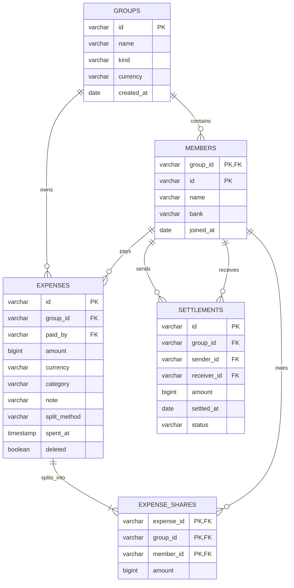

# SplitUZ ERD

## Financial integrity

- Money is stored as integer `BIGINT` UZS; floating-point arithmetic is never used.
- `(group_id, member_id)` is the participant identity, preventing cross-group references.
- `(expense_id, group_id)` on shares must reference the same expense and group.
- Expense and settlement amounts must be positive; share amounts must be non-negative.
- Sender and receiver of a settlement must be different.
- Expense plus all normalized shares is committed in one transaction.

